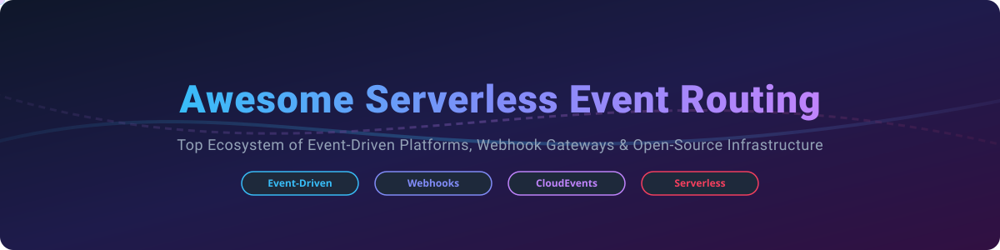

# ⚡ Awesome Serverless Event Routing 🚀

  

## 🌐 Top Serverless Event Routing Ecosystem

> 📌 **Curated Directory of Cloud SaaS Platforms & Open-Source Infrastructure**  
> *Focused on Event-Driven Architecture (EDA), Webhook Delivery Systems, Event Mesh Routing, and Serverless Task Automation.*

*Last updated: October 2026*

Welcome to the definitive guide for **Serverless Event Routing**, **Webhook Infrastructure**, and **Event-Driven Microservices**. This repository tracks leading commercial SaaS platforms and production-ready open-source projects designed to seamlessly connect event producers to event consumers — routing, filtering, transforming, and guaranteeing message delivery across distributed systems without managing infrastructure.

---

## 📋 Table of Contents

- [📊 SaaS & Hosted Platforms](#-saas--hosted-platforms)
- [🔓 Open-Source GitHub Projects](#-open-source-github-projects)
  - [⚡ Event Routing & Event Mesh](#-event-routing--event-mesh)
  - [🪝 Webhook Infrastructure](#-webhook-infrastructure)
  - [🔔 Notification Infrastructure](#-notification-infrastructure)
  - [🔄 Job Queues & Workflow Engines](#-job-queues--workflow-engines)
  - [📦 Additional Open-Source Libraries & SDKs](#-additional-open-source-libraries--sdks)
- [📈 Star History](#-star-history)
- [🤝 How to Contribute](#-how-to-contribute)
- [💖 Support & Sponsorship](#-support--sponsorship)
- [⚠️ Disclaimer](#%EF%B8%8F-disclaimer)

---

## 📊 SaaS & Hosted Platforms

> 📈 **Market Size & Industry Dynamics:**  
> The global **Event-Driven Architecture & Serverless Event Routing market** is estimated at **$6.2 Billion (2026)** and is projected to reach **$14.8 Billion by 2030** (CAGR ~24.3%). The market is **moderately fragmented**: Cloud hyperscalers (AWS, Azure, Google Cloud) dominate core infrastructure event routing, while specialized developer-centric SaaS providers (Trigger.dev, Novu, Svix, Hookdeck) capture rapid growth in developer experience, notification routing, and webhook delivery management.

Below is a detailed comparison of top hosted serverless event routing, background processing, and webhook infrastructure providers sorted by estimated company valuation / market capitalisation (descending).

| Platform 🏢 | Valuation / Market Cap 💰 | Description 📝 | Starting Paid Pricing 🏷️ | Free Tier / Trial Limit 🎁 |
| :--- | :--- | :--- | :--- | :--- |
| **[Google Cloud Eventarc](https://cloud.google.com/eventarc)** | **~$2.1 Trillion** *(Alphabet Cap)* | CloudEvents-compliant event routing for Google Cloud services and custom microservices. | $0.60 per 1 million events published | First 3 Million events per month free |
| **[Azure Event Grid](https://azure.microsoft.com/en-us/products/event-grid)** | **~$3.1 Trillion** *(Microsoft Cap)* | Fully managed pub/sub event router with dead-lettering, filtering, and CloudEvents support. | $0.60 per 1 million operations | First 100,000 operations per month free |
| **[AWS EventBridge](https://aws.amazon.com/eventbridge/)** | **~$1.9 Trillion** *(Amazon Cap)* | Enterprise serverless event bus with schema registry, event replay, and SaaS integrations. | $1.00 per 1 million custom events ingested | 14,000,000 Scheduler invocations/mo free |
| **[Cloudflare Queue](https://developers.cloudflare.com/queues/)** | **~$35 Billion** *(Cloudflare Cap)* | Edge-native message queue for asynchronous event processing with Workers integration. | $0.40 per 1 million operations (Workers Paid) | 1,000,000 operations per month free |
| **[Courier](https://www.courier.com/)** | **~$200 Million** | Notification routing API across Email, SMS, Push, and Chat with rules & workflows. | $99/month (Developer Plan) | 10,000 notifications per month free |
| **[Inngest](https://www.inngest.com/)** | **~$60 Million** | Event-driven background jobs platform with step functions, automatic retries, & concurrency control. | $75/month (Pro Plan) | 50,000 step runs per month free |
| **[Trigger.dev](https://trigger.dev/)** | **~$45 Million** | Open-source background jobs framework with event-driven triggers, long-running tasks, and observability. | $50/month (Team Plan) | 50,000 runs per month free |
| **[Knock](https://knock.app/)** | **~$40 Million** | Multi-channel notification infrastructure with drag-and-drop workflow routing and preferences. | $250/month (Growth Plan) | 10,000 notifications per month free |
| **[Hookdeck](https://hookdeck.com/)** | **~$25 Million** | Event gateway for receiving, transforming, filtering, and monitoring webhooks at scale. | $69/month (Growth Plan) | 100,000 webhooks per month free |
| **[Svix](https://www.svix.com/)** | **~$20 Million** | Webhook-as-a-service platform with customer portals, automatic retries, and HMAC signatures. | $49/month (Startup Plan) | 50,000 messages per month free |

---

## 🔓 Open-Source GitHub Projects

Explore production-grade open-source tools for building custom serverless event routers, webhook delivery gateways, notification routing systems, and background job queues. Sorted by GitHub Star Count (descending).

### ⚡ Event Routing & Event Mesh

- **[novuhq/novu](https://github.com/novuhq/novu)**   
  📡 **Open-source notification infrastructure & routing engine.** Unified API for email, SMS, push, and webhooks with visual workflow builder and multi-tenant management.

- **[drasi-project/drasi](https://github.com/drasi-project/drasi)**   
  ⚡ **Microsoft's real-time continuous query & event detection system.** Evaluates data-in-motion without polling overhead and triggers automated reactions across PostgreSQL, Dataverse, and Event Grid.

- **[iggy-rs/iggy](https://github.com/iggy-rs/iggy)**   
  🚀 **Ultra-low latency message streaming platform written in Rust.** Ultra-fast Kafka alternative designed for high-throughput serverless event streaming and routing.

- **[zeiss/typhoon](https://github.com/zeiss/typhoon)**   
  🌀 **Cloud-native AWS EventBridge alternative built on NATS and Knative.** Features declarative event routing, replay capabilities, transformations, and Kubernetes native scaling.

- **[vanus-labs/vanus-connect](https://github.com/vanus-labs/vanus-connect)**   
  🔌 **Event streaming & routing connectors ecosystem.** Connects SaaS tools, databases, and message queues into standard CloudEvents flows.

- **[ce-rust/cerk](https://github.com/ce-rust/cerk)**   
  ⚙️ **Microkernel CloudEvents router in Rust.** Modular architecture for routing CloudEvents across various transport protocols, brokers, and enterprise endpoints.

- **[hyperpolymath/hybrid-automation-router](https://github.com/hyperpolymath/hybrid-automation-router)**   
  🔀 **Intelligent event routing engine for hybrid automation.** Supports 7 routing strategies (RoundRobin, LeastLoaded, Failover, TagMatch) for Ansible, Terraform, and Puppet target environments.

---

### 🪝 Webhook Infrastructure

- **[hookdeck/outpost](https://github.com/hookdeck/outpost)**   
  🛡️ **Outbound webhooks & event destination infrastructure.** Enables event fanout, multi-tenant subscription routing, OpenTelemetry instrumentation, and reliable at-least-once delivery.

- **[hookdash/hookdash](https://github.com/hookdash/hookdash)**   
  🎯 **Zero-config self-hosted webhook gateway powered by SQLite.** Signature verification for Stripe/GitHub/Shopify, circuit breakers, dead-letter queues, and real-time dashboard.

- **[boringContributor/aws-serverless-webhooks](https://github.com/boringContributor/aws-serverless-webhooks)**   
  ☁️ **Self-hosted serverless webhook gateway on AWS CDK.** Uses Durable Functions, API Gateway, and EventBridge for resilient webhook dispatching.

- **[xtandard/webhooks](https://github.com/xtandard/webhooks)**   
  📚 **Embeddable webhook delivery library based on Standard Webhooks.** Two-plane architecture with lease-based recovery for zero-service-overhead webhook routing.

- **[summerwind/cloudevents-webhook-gateway](https://github.com/summerwind/cloudevents-webhook-gateway)**   
  🔗 **HTTP Webhook to CloudEvents gateway.** Converts incoming HTTP webhooks into CloudEvents specification format for standardized serverless ingestion.

---

### 🔔 Notification Infrastructure

- **[novuhq/novu](https://github.com/novuhq/novu)**   
  📣 **Unified notification orchestrator.** Self-hosted open-source alternative to Knock and Courier with in-app inbox components, template management, and routing logic.

---

### 🔄 Job Queues & Workflow Engines

- **[benrobo/queueflow](https://github.com/benrobo/queueflow)**   
  ⏱️ **Minimal Redis background task queue for TypeScript.** Automatic worker initialization, cron scheduling, and exponential backoff built on BullMQ.

- **[alialnaghmoush/flowli](https://jsr.io/@alialnaghmoush/flowli)**   
  🛠️ **Type-safe TypeScript job & workflow execution framework.** In-process and persisted lease-based queue execution for Hono, Next.js, and TanStack Start.

---

### 📦 Additional Open-Source Libraries & SDKs

- **[cloudevents/sdk-go](https://github.com/cloudevents/sdk-go)**  — Official Go SDK for building CloudEvents compliant event routers.
- **[Accenture/reactive-interaction-gateway](https://github.com/Accenture/reactive-interaction-gateway)**  — Elixir-based low-latency event gateway for microservices.
- **[silverton-io/buz](https://github.com/silverton-io/buz)**  — Serverless multi-protocol event collector and router in Go.
- **[myntra/cortex](https://github.com/myntra/cortex)**  — Fault-tolerant real-time event and alert correlation engine.
- **[sasha-tkachev/venty](https://github.com/sasha-tkachev/venty)**  — Event-driven routing utilities built around the CloudEvents specification.

---

## 📈 Star History

---

## 🤝 How to Contribute

Contributions are warmly welcome! Please follow these simple steps:

1. **Fork** this repository.
2. Add your tool or project under the appropriate section in `README.md` following the existing format.
3. Ensure entries include a concise 1-2 sentence description, official website or GitHub repository link, and accurate pricing/star details.
4. Submit a **Pull Request** with a brief summary of the added repository.

---

## 💖 Support & Sponsorship

If this curated list saved you time or helped you build event-driven infrastructure, please consider supporting the project!

- ⭐ **Star** this repository to increase visibility.
- 🔀 **Fork** and share it with your dev team or platform engineers.
- ☕ **Buy me a coffee / Sponsor:** Support ongoing maintenance via the [GitHub Sponsor Dashboard](https://github.com/sponsors/ishandutta2007).

Thank you to all contributors and community members building open-source event-driven tooling! 🙌

---

## ⚠️ Disclaimer

- This list is **community-curated** for educational and architectural reference purposes only.
- Serverless event routing handles sensitive payloads. Ensure proper end-to-end security, HMAC verification, and access controls for all self-hosted and managed tools.
- Webhook delivery is at-least-once by design; ensure event handlers implement idempotency.

---

**Made with ❤️ for platform engineers, backend developers, and cloud architects.**
